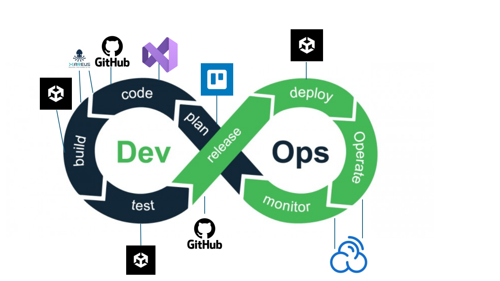

# DevOps for UltraInstinctVR

## Plan
Project planning is conducted using **Trello**, where user stories and features are defined and prioritized.  
User stories may originate from **research requirements** or **industrial needs**, depending on the targeted use case.

---

## Code

### GitHub
GitHub is used as the primary **version control platform**.  
We enforce a set of **branch protection rules** on the `main` branch and apply a **branch-naming convention** to maintain consistency across contributions.

#### `main` Branch
All changes to the `main` branch must go through a **pull request (PR)**.  
Each PR must be **reviewed and approved by at least one contributor** before being merged.

#### Branch Naming Policy
- **Research features:** `RES-featureName`
- **Industrial features:** `FEAT-featureName`
- **Bug fixes related to a feature:** `FIX-nameFix-featureName`

### Unity
Unity is used as both the **3D engine** and the primary **development environment** for implementing the UltraInstinctVR framework.

#### Xareus
Xareus is a Unity plug-in that leverages **formal methods** to detect interactions and trigger actions in VR environments.  
In our framework, Xareus is used to **define Petri-net–based oracles** for VR testing.

### Visual Studio
Visual Studio, the IDE recommended by Unity, is used to develop the various features and components of UltraInstinctVR.

---

## Build
Unity is used to build applications, and build automation is handled through **`game-ci@v4`**, enabling continuous integration for Unity projects.

---

## Test
- *To be completed.*

---

## Release
- *To be completed.*

---

## Deploy
- *To be completed.*

---

## Operate and Monitor
We use **SonarCloud** to monitor code quality, including reliability, security, maintainability, and code-smell detection.
